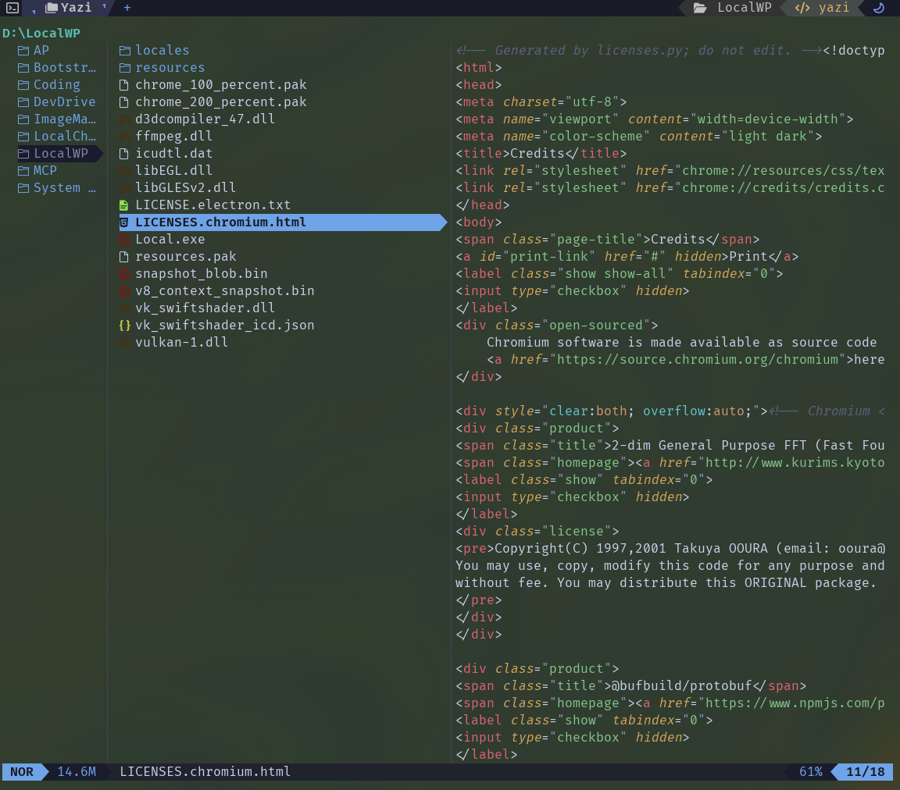

<div align="center">
  
</div>

<h3 align="center">
	Aurora Storm Flavor for <a href="https://github.com/sxyazi/yazi">Yazi</a>
</h3>

## 👀 Preview



## 🎨 Installation

### Using package manager

```bash
ya pkg add kshakwat/aurora-storm
```

### Manual install

```bash
# Linux/macOS
git clone https://github.com/kshakwat/yazi-theme/aurora-storm.yazi.git ~/.config/yazi/flavors/aurora-storm.yazi

# Windows
git clone https://github.com/kshakwat/yazi-theme/aurora-storm.yazi.git %AppData%\yazi\config\flavors\aurora-storm.yazi
```

## ⚙️ Usage

Add the these lines to your `theme.toml` configuration file to use it:


```toml
[flavor]
use = "aurora-storm"
# For Yazi 0.4 and above
# switch between light and dark automatically based on terminal settings
dark = "aurora-storm"
light = "aurora-dawn"
```

## 💡 See Also

Prefer a darker look? Check out the storm version: **[Aurora Dawn](https://github.com/kshawkat/aurora-dawn)**!

## 📜 License

The flavor is MIT-licensed, and the included tmTheme is also MIT-licensed.

Check the [LICENSE](LICENSE) and [LICENSE-tmtheme](LICENSE-tmtheme) file for more details.
